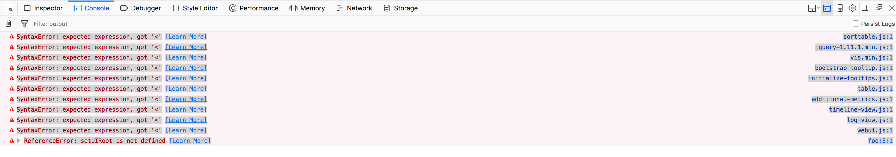

# The Kubernetes "Whatever-your-heart-desires" Operator

## Introduction

Today, we are excited to announce the Kubernetes Operator; a new mechanism for launching containers using the Kubernetes cloud deployment framework. 

Since its inception, Airflow's greatest strength has been its flexibility. Airflow offers a wide range of native operators for services ranging from Spark and HBase, to GCP and s3. Airflow also offers easy extensibility through its plugin framework. However, one limitation of the project is that Airflow users are confined to the frameworks and clients that exist on the Airflow worker at the moment of execution. If a user wishes to use a different version of scipy or test a new deep learning framework, they would need to either launch a new airflow cluster or risk conflicting with the dependencies of other users' workflows. 

To address this issue, we've utilized kubernetes to allow users to launch arbitrary docker containers and configurations. Airflow users can now have full power over their run-time environments, resources, and secrets, basically turning airflow into an "any job you want" scheduler.

## What Is Airflow?

Apache Airflow is one realization of the DevOps philosophy of "Code As Configuration." Airflow allows users to launch multi-step pipelines using a simple python object DAG (Directed Acyclic Graph). You can define dependencies, programatically construct complex workflows, and monitor scheduled jobs in an easy to read UI.
 
  

 
 
 Airflow comes with built-in operators for frameworks like Apache Spark, BigQuery, Hive, and EMR. It also offers a Plugins entrypoint that allows DevOps engineers to develop their own connectors.
 
## What is Kubernetes?

Before we go any further, let's take a moment for a quick overview of Kubernetes. [Kubernetes](https://kubernetes.io/) is an open-source container deployment engine released by Google. Based on Google's [Borg](http://blog.kubernetes.io/2015/04/borg-predecessor-to-kubernetes.html), kubernetes allows for easy deployment of images using a highly flexible API. Using kubernetes you can [deploy spark jobs](https://github.com/apache-spark-on-k8s/spark), launch end-to-end applications, or create multi-framework ETL pipelines using yaml, json, python, golang, or java bindings. The kubernetes API's programatic launching of containers seemed a perfect marriage with Airflow's "code as configuration" philosophy.

## The Kubernetes Operator

As DevOps pioneers, Airflow users are always looking for ways to make deployments and ETL pipelines simpler to manage. Any opportunity to decouple our pipeline steps while increasing monitoring can reduce future outages and fire-fights. The following is a list of benefits the Kubernetes Operator has in reducing the Airflow Engineer's footprint
* **Increased flexibility for deployments:**  
Airflow's plugin API has always offered a significant boon to engineers wishing to test new functionalities within their DAGS. On the downside, whenever a developer wanted to create a new operator, they had to develop an entirely new plugin. Now, any task that can be run within a Docker container is accessible through the exact same operator, with no extra Airflow code to maintain.
* **Flexibility of configurations and dependencies:** 
For operators that are run within static Airflow workers, dependency management can become quite difficult. If I want to run one task that requires [SciPy](https://www.scipy.org) and another that requires [NumPy](http://www.numpy.org), the developer would have to either maintain both dependencies within an Airflow worker or somehow configure ??
* **Usage of kubernetes secrets for added security:** 
Handling sensitive data is a core responsibility of any devops engineer. At every opportunity, airflow users want to minimize any API keys, database passwords, and login credentials to a strict need-to-know basis. With the kubernetes operator, users can utilize the kubernetes Vault technology to store all sensitive data. This means that the airflow workers will never have access to this information, and can simply request that pods be built with only the secrets they need

# Architecture


The Kubernetes Operator uses the [Kubernetes Python Client](https://github.com/kubernetes-client/python) to generate a request that is processed by the APIServer (1). Kubernetes will then launch your pod with whatever specs you've defined (2). Images will be loaded with all the necessary environment variables, secrets and dependencies, enacting a single command. Once the job is launched, the operator only needs to monitor the health of track logs (3). Users will have the choice of gathering logs locally to the scheduler or to any distributed logging service currently in their Kubernetes cluster

# Using the Kubernetes Operator

## A Basic Example

The following DAG is probably the simplest example we could write to show how the kubernetes operator works. This DAG  creates two pods on Kubernetes: a linux distro with python and a base ubuntu without. The Python pod will run the Python request correctly, while the one without Python will report a failure to the user. If the operator is working correctly, the `passing-task` pod should complete while the `failing-task` pod returns a failure to the airflow webserver.


```python
from airflow import DAG
from datetime import datetime, timedelta
from airflow.contrib.operators.kubernetes_pod_operator import KubernetesPodOperator
from airflow.operators.dummy_operator import DummyOperator


default_args = {
    'owner': 'airflow',
    'depends_on_past': False,
    'start_date': datetime.utcnow(),
    'email': ['airflow@example.com'],
    'email_on_failure': False,
    'email_on_retry': False,
    'retries': 1,
    'retry_delay': timedelta(minutes=5)
}

dag = DAG(
    'kubernetes_sample', default_args=default_args, schedule_interval=timedelta(minutes=10))


start = DummyOperator(task_id='run_this_first', dag=dag)

passing = KubernetesPodOperator(namespace='default',
                          image="python:3.6",
                          cmds=["python","-c"],
                          arguments=["print('hello world')"],
                          labels={"foo": "bar"},
                          name="passing-test",
                          task_id="passing-task",
                          get_logs=True,
                          dag=dag
                          )

failing = KubernetesPodOperator(namespace='default',
                          image="ubuntu:1604",
                          cmds=["python","-c"],
                          arguments=["print('hello world')"],
                          labels={"foo": "bar"},
                          name="fail",
                          task_id="failing-task",
                          get_logs=True,
                          dag=dag
                          )

passing.set_upstream(start)
failing.set_upstream(start)
```




## But how does this relate to my workflow?

While this example only uses basic images, the magic of docker is that this same DAG will work for any image/commandpairing you want. The following is a recommended CI/CD pipeline to run production-ready code on an airflow DAG.

### 1: PR in github
Use travis or jenkins to run unit and integration tests, bribe your favorite team-mate into PRing your code, and merge to the master branch to trigger an automated CI build

### 2: CI/CD via jenkins -> Docker Image

There are a multitude on articles on [generating docker files within a Jenkins build](https://getintodevops.com/blog/building-your-first-docker-image-with-jenkins-2-guide-for-developers). It's a good rule of thumb that you should never use a user-generated docker image in a production build. By reserving release tags to the jenkins user, you can ensure that malicious or untested code will never be run by your production airflow instances.

### 3: Airflow launches task 

Finally: Update your DAGs to reflect the new release version and you should be ready to go!

```python
production_task = KubernetesPodOperator(namespace='default',
                          # image="my-production-job:release-1.0.1", <-- old release
                          image="my-production-job:release-1.0.2",
                          cmds=["python","-c"],
                          arguments=["print('hello world')"],
                          name="fail",
                          task_id="failing-task",
                          get_logs=True,
                          dag=dag
                          )
```
                          
                          
# Closing Statements

The Kubernetes Operator is by no means the end of Airflows' partnership with the Kubernetes community. There is active development on a [native Kubernetes executor](https://github.com/apache/incubator-airflow/pull/2414) that will offer dynamic allocation and customization at the airflow level. We have some exciting projects in the works, and we look forward to seeing what awesome use-cases you are able to create!
